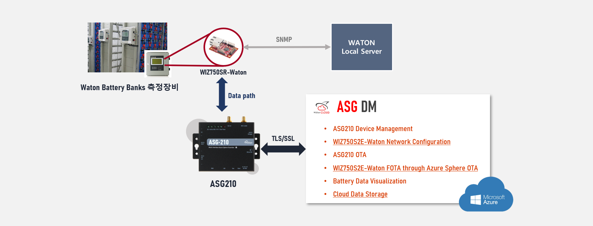
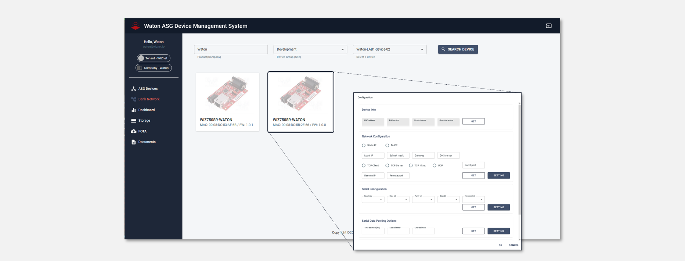

## ASG Device Management 서비스
ASG Device Management Service는 Azure 기반의 ASG210(Azure Sphere Guardian 210) 및 ASG210과 함께 정의된 하위 디바이스인 customed WIZ750SR을 원격 보안 관리, 모니터링, 제어할 수 있는 서비스이다.
ASG DM(Device Management service)의 핵심 서비스는 On-premise 구조의 시스템이 ASG210이 제공하는 Ethernet 또는 다양한 인터페이스(UART/I2C/GPIOs) 통신을 통하여 기존 시스템의 변경없이 Cloud를 사용할 수 있도록 함에 있고 이를 위한 ASG210의 제어 및 모니터링 사용자 서비스를 제공한다.

## ASG DM 블록 다이어그램
ASG DM은 MS Azure에서 서비스하는 Azure Sphere 전용 Security service, IoT Core system, 그리고 사용자 Web service를 위한 Azure App service로 구성되어 있다.

## ASG DM - Waton
ASG DM은 다양한 On-premise 구조에 적용하기 위한 Customizing 서비스를 제공한다. Waton의 PoC를 통하여 ASG DM은 ASG210 외에도 Waton에서 기존에 사용되던 시스템인 WIZ750SR-Waton 디바이스의 네트워크 설정, 연결상태 체크등을 위한 추가 커스터마이징 작업이 진행되었다.
또한 ASG210을 통해 Cloud로 전송되는 Battery 데이터를 효과적으로 모니터링하기 위한 Battery Bank Tree 구조의 대시보드가 추가되었다.
마지막으로 WIZ750SR-Waton이 기존 시스템과 통신하면서 동시에 ASG210과의 통신을 통해 Battery Data를 Cloud로 전송할 수 있도록 WIZ750SR-Waton 펌웨어 수정 작업이 진행되었다.

(WIZ750SR-waton customed 명시)

## NEXT
WIZnet ASG210(Azure Sphere Guardian 210)

WIZ750SR-Waton 1.0.1 설명 및 Configuration Tool 사용법

ASG DM 서비스 가이드

